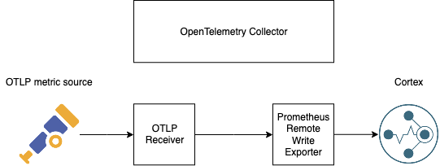
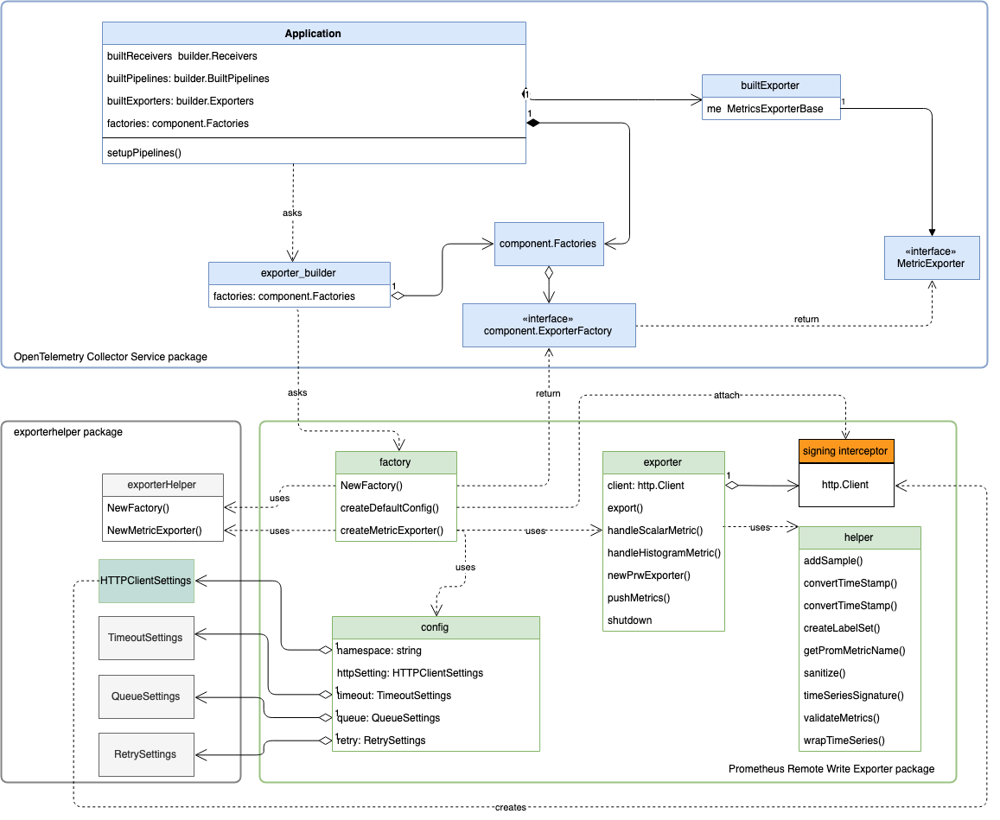

# OpenTelemetry Collector O11y

This repository is focused on building and packaging the OpenTelemetry Collector with a Prometheus remote write exporter
 supporting Sig V4 to export to AWS services. See [Testing](#testing) section on how to generate and send a OTLP metric 
 load to a 
 Prometheus remote write backend.

## Components

Most upstream components are removed and not included in the build. Available components are:

* Receiver: OpenTelemetry Protocol(OTLP) receiver 
* Processor: None
* Exporter: Logging exporter, Prometheus remote write exporter

A Collector pipeline with these components is illustrated below:




## Initialization

Components in the collector are initialized by the Collector Service based on configuration. The factory and 
configuration of a component are invoked at the initialization of the Collector Application, and they supply the 
components with parameters components need. AWS Sig V4 support could be passed to the exporter by the factory without 
impacting the data conversion and export logic. 

The Prometheus remote write exporter use this pattern. During application initialization, the collector asks exporter 
builders, a service package component, for an implementation of the MetricExporter interface. Then, the exporter builder
 invokes the factory code inside the Prometheus Remote Write Exporter package to create an instance of the Prometheus 
 Remote Write Exporter. When invoked, factory uses the exporter helper package to wrap the Exporter implementation 
 inside the MetricExporter interface, and returns the instance to the Collector Application. **The factory can also 
 pass in an [Sig V4 interceptor-attached http.Client](https://github.com/open-o11y/opentelemetry-collector-o11y/blob/dd88d38914fc2b9faa5e3dd26606e3a4a46934c2/exporter/prometheusremotewriteexporter/factory.go#L181) to the exporter**.  Finally, the Collector Application
  assembles the export pipeline with the exporter. During an export operation, the exporter behaves the same, but the 
  interceptor-attached http.Client performs signing of each request.



## Sample Configuration

The following is a configuration for a Collector instance that receives gRPC OTLP metrics on `localhost:55680`, a 
logging exporter that logs metric to `stdout`, and a Prometheus remote write exporter sending to an endpoint with AWS 
Sig V4 support enabled. 

```
receivers:
     otlp:
      protocols:
         grpc:
exporters:
  prometheusremotewrite:
    endpoint: "https://aps-workspaces-beta.us-west-2.amazonaws.com/workspaces/yang-yu-intern-test-ws/remote_write"
    namespace: otel-collector
    auth:
      region: "us-west-2"
      service: "stealfire"
    timeout: 10s
  logging:
    loglevel: debug

service:
  extensions:
  pipelines:
    metrics:
      receivers: [otlp]
      exporters: [logging,prometheusremotewrite]
```

see a complete list of configuration options and explanation of the prometheus remote write exporter [here](./exporter/prometheusremotewriteexporter/README.md)

## Testing 

To test the exporter, run the following command:

```
make testaps
```

This starts a Collector based on configuration in `/test/otel-config.yaml` and runs OTLP metric load generator to send 
metrics to the exporter. OTLP metrics are generated based on `/test/data/metrics.txt`. After the load generator exists,
 it runs a querier to get metrics from the specified endpoint and write the output in `/test/data/ans.txt`. 

More details of testing, load generator and querier are described [here](./test/README.md). 

